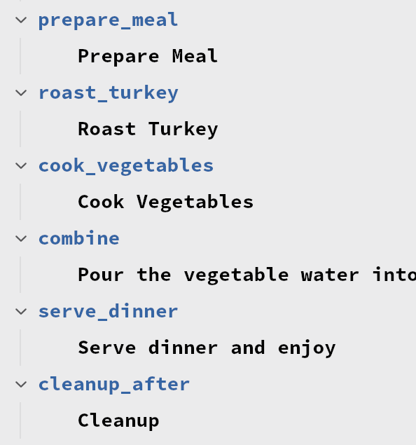

# Technique language support for the Zed Editor

This repository contains machinery for syntax highlighting and syntax checking
for Technique files in the Zed Editor in the form of a language extension
which contains the extension's configuration, a Tree Sitter grammar,
appropriate metadata to detect the file type, and the machinery to download
and install the language server.

The Tree Sitter grammar here is referenced by Git URL and commit hash from
**technique-lang/tree-sitter-technique**. Note that that grammar is _not_ a
complete parser to a full abstract syntax tree; rather its only requirement
is to produce tokens for the purpose of syntax highlighting a Technique file
in the Zed Editor.

This repository also contains the machinery to download and run the Technique
language server which provides locations of parser errors back to the editor.

## Features

Symbol search:


Document structure in Outline:



## Enabling

You can obtain this extension from the central Zed Extensions repository by
searching for `technique` on the Zed [Extensions](https://zed.dev/extensions)
page or in the "Extensions" tab in the Zed Editor.

If you want to run the extension from the repository you can install this
extension by likewise opening the "Extensions" tab in the Zed Editor
(**\<Ctrl\>**+**\<Shift\>**+**X** on Linux) but instead selecting "Install Dev
Extension".

## Syntax Highlighting Colours

You will also want to set the colours used when syntax highlighting. This isn't
directly supported by Zed, but by adding entries under the
`"experimental.theme_overrides"` key in your _settings.json_ you can have Zed
use the correct colours for Technique files. This works as all the mappings in
_languages/technique/highlights.scm_ are marked as being `function.technique`
or `punctuation.bracket.technique` giving us a unique string to match on in the
user settings so that we don't corrupt normal theme-driven highlighting for
other file types.

```json
  "experimental.theme_overrides": {
    "syntax": {
      // Declaration
      "constructor.technique": {
        "color": "#3465a4",
        "font_weight": 700
      },
```

and so on. A suitable `"experimental.theme_overrides"` value is in
_config/settings.json-sample_ and can be copied from there into your user
settings.

## Developing

This extension will download and decompress a released build of the
_technique_ binary to invoke as the Language Server Protocol server. If,
however, you are testing changes to the LSP service you can instead override
the location of the binary in your _settings.json_ file to point at the one
you are building locally, for example:

```json
  "lsp": {
    "technique": {
      "binary": {
        "path": "/home/andrew/src/technique-lang/technique/target/debug/technique",
        "arguments": ["language"],
      }
    },
```
